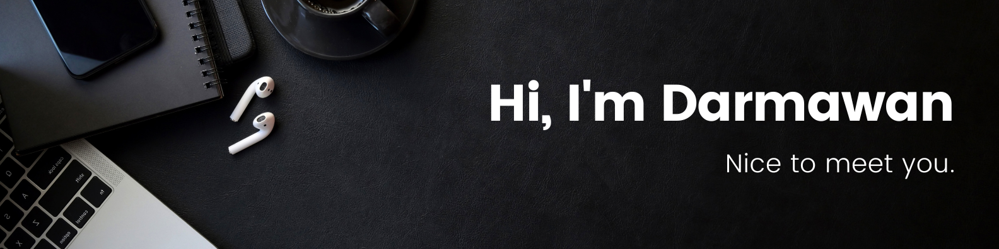

<h2> About Me</h2>

I'm a sixth-semester Computer Engineering student at ITS. As the Leader of the Programmer division at Barunastra ITS Roboboat Team, I specialize in frontend web development and have a keen interest in robotics. Driven by a passion for learning and a desire to excel, I'm eager to leverage my skills to make impactful contributions to the ever-evolving tech industry.

<h2> Languages and Tools</h2>

I have hands-on experience with a variety of programming languages and tools, particularly those commonly utilized in frontend web development and robotics.

<b>Frontend Web Development</b>

 

    
    
    
    
    
    

<b>Robotics</b>

 

    
    
    
    
    
    
    

<b>Other Technologies</b>

 

    
    
    
    
    
    
    
    

<h2> Contact Me</h2>

Thank you for visiting! If you have any questions or projects you'd like to discuss, feel free to get in touch! You can contact me via <a href="mailto:wayanagus.dr@gmail.com">email</a> or connect with me on <a href="https://www.linkedin.com/in/agusdarmawann/">LinkedIn</a>.

